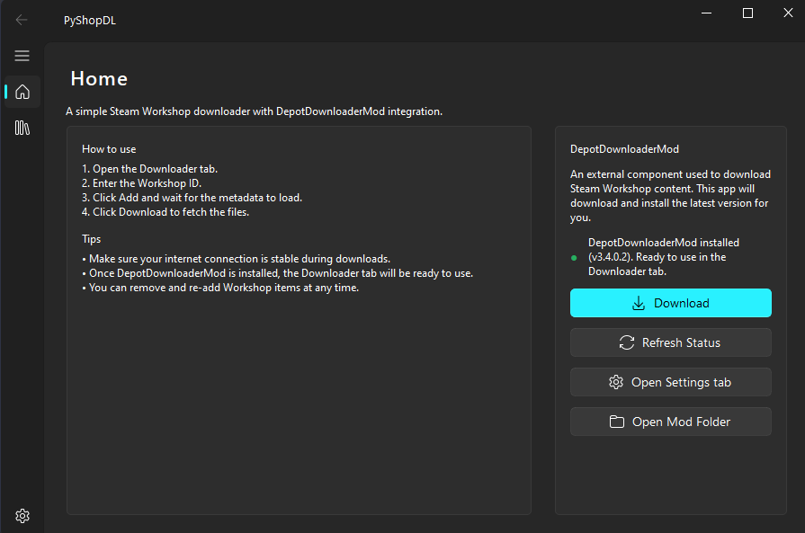

> [!WARNING]
> PyShopDL still on development

## PyShopDL

PyShopDL is a small desktop client for downloading Steam Workshop items using a modern Fluent-style interface. It wraps the third‑party **DepotDownloaderMod** command‑line tool in a simple GUI so you can queue workshop IDs, inspect their metadata, and download them sequentially without touching a terminal.

> This project is intended for personal use with content you are allowed to download. Always follow Steam's terms of service and each Workshop item's license.

---

### Features

- Fluent UI built with **PySide6** and **qfluentwidgets**
- One‑click download & installation of the latest **DepotDownloaderMod** release from GitHub
- "Downloader" tab for:
	- Adding Workshop IDs to a table
	- Fetching metadata from the Steam Web API (name, size, app ID)
	- Status tracking per item (Loading, Ready, Queue, Process, Complete, Error)
	- Sequential download queue using DepotDownloaderMod
- "Home" tab with quick usage guide and DepotDownloaderMod status (installed / not installed, detected version)
- "Settings" tab stub (ready for future configuration options)

---

### Screenshots
> Home Page


---

### Installation

1. **Clone the repository**

	 ```bash
	 git clone https://github.com/BloodLetters/PyShopDL.git
	 cd PyShopDL
	 ```

2. **Create and activate a virtual environment (optional but recommended)**

	 ```bash
	 python -m venv .venv
	 .venv\\Scripts\\activate
	 ```

3. **Install Python dependencies**

	 ```bash
	 pip install -r requirements.txt
	 ```

	 (Or install the packages listed in the Requirements section manually.)

4. **First‑time DepotDownloaderMod setup**

	 - No manual download is needed; PyShopDL can fetch the latest version for you.
	 - On first run, open the **Home** tab and press **Download** in the DepotDownloaderMod card. The app will:
		 - Call the GitHub Releases API for `SteamAutoCracks/DepotDownloaderMod`
		 - Download `Release.rar` into the `cache/` folder
		 - Extract the archive and copy the contents into `DepotDownloaderMod/`
		 - Write the current version to `DepotDownloaderMod/version.txt`

---

### Usage

1. **Run the application**

	 ```bash
	 python main.py
	 ```

2. **Home tab**

	 - Verify DepotDownloaderMod status (installed / version shown).
	 - If not installed, click **Download** to fetch and install it.
	 - Use **Refresh Status** to re‑check after an installation.
	 - **Open Mod Folder** opens the `DepotDownloaderMod/depots` directory where downloads are stored.

3. **Downloader tab**

	 - Enter a Steam Workshop ID into the input box (numeric ID from the Workshop URL).
	 - Click **Add**:
		 - The item is appended to the table.
		 - Metadata (title, size, app ID) is fetched from the Steam Web API.
	 - After items show status **Ready**, click **Download**:
		 - Items are put into a queue and processed sequentially.
		 - Each item’s status will update through `Queue → Process → Complete` (or `Error`).

4. **Settings tab**

	 - On Progress

---

### How It Works (Internals)

- **DepotDownloaderMod integration**
	- `utils/downloader.py` checks the latest release on GitHub, downloads `Release.rar`, extracts it, and writes a `version.txt` file.
	- The Home and Downloader tabs locate the executable as `DepotDownloaderMod/DepotDownloaderMod.exe`.

- **Metadata fetching**
	- `utils/metadata.py` calls the Steam Web API endpoint `ISteamRemoteStorage/GetPublishedFileDetails` and parses the response.
	- The Downloader tab runs metadata requests in background `QThread`s so the UI stays responsive.

- **Download queue**
	- `utils/workshop.py` builds a `DepotDownloaderMod.exe` command like:

		```text
		DepotDownloaderMod.exe -app <app_id> -pubfile <workshop_id>
		```

	- `tab/ListTab.py` starts the process, reads stdout, and heuristically determines completion when it sees lines like `Disconnected from Steam` or `Total downloaded:`.
	- Jobs are executed one‑by‑one using an internal download queue.

---

### License

Specify your license here (for example MIT, Apache‑2.0, etc.). Also note that **DepotDownloaderMod** is a separate project with its own license; make sure to review and comply with it when distributing or using this application.
