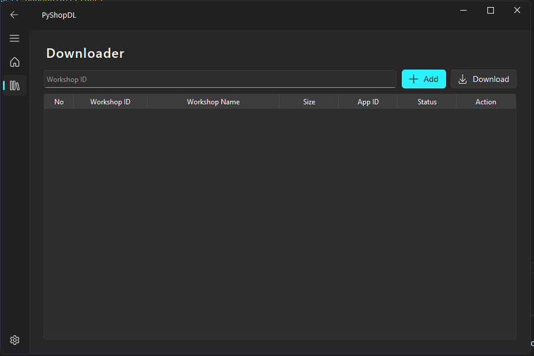

<h2 align="center">PyShopDL</h2>

<p align="center">
  <a href="https://github.com/BloodLetters/PyShopDL/releases/latest">
    
  </a>
  <a href="https://github.com/BloodLetters/PyShopDL/commits/main">
    
  </a>
  <a href="https://github.com/BloodLetters/PyShopDL/actions/workflows/Build.yml">
    
  </a>
</p>


PyShopDL is a desktop client for downloading Steam Workshop items using a modern Fluent-style interface. It wraps the third‑party [DepotDownloaderMod](https://github.com/SteamAutoCracks/DepotDownloaderMod) command‑line tool in a simple GUI so you can queue workshop IDs, inspect their metadata, and download them sequentially without touching a terminal or official steam client.

</img> <br>
---

### Features
- Fluent UI built with **PySide6** and **qfluentwidgets**
- One‑click download & installation of the latest **DepotDownloaderMod** release from GitHub
- Fetching metadata from the Steam Web API (name, size, app ID)
- Status tracking per item (Loading, Ready, Queue, Process, Complete, Error)
- Sequential download queue using DepotDownloaderMod
- Multi threaded download

---

### Screenshots



---

### Installation

#### Option 1 – Prebuilt release (recommended)

1. Go to the [Releases](https://github.com/BloodLetters/PyShopDL/releases) page.
2. Download `PyShopDL.exe`.
3. Double‑click `PyShopDL.exe` to run the application.

#### Option 2 – Run from source (Python)

1. **Clone the repository**

	```bash
	git clone https://github.com/BloodLetters/PyShopDL.git
	cd PyShopDL
	```

2. **Create and activate a virtual environment (optional but recommended)**

	```bash
	python -m venv .venv
	.venv\Scripts\activate
	```

3. **Install dependencies**

	```bash
	pip install -r requirements.txt
	```

4. **Run the application**

	```bash
	python main.py
	```

---

### Usage

1. **Home tab**

	 - Verify DepotDownloaderMod status (installed / version shown).
	 - If not installed, click **Download** to fetch and install it.
	 - Use **Refresh Status** to re‑check after an installation.
	 - **Open Mod Folder** opens the `DepotDownloaderMod/depots` directory where downloads are stored.

2. **Downloader tab**

	 - Enter a Steam Workshop ID into the input box (numeric ID from the Workshop URL).
	 - Click **Add**:
		 - The item is appended to the table.
		 - Metadata (title, size, app ID) is fetched from the Steam Web API.
	 - After items show status **Ready**, click **Download**:
		 - Items are put into a queue and processed sequentially.
		 - Each item’s status will update through `Queue → Process → Complete` (or `Error`).
